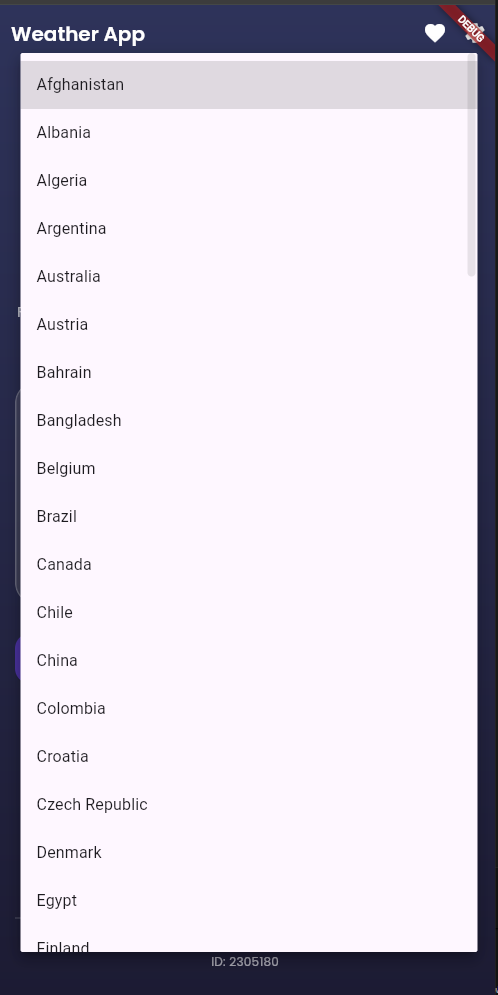
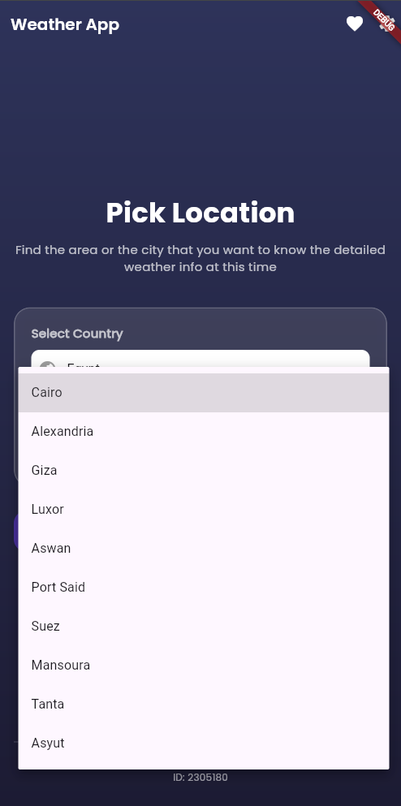
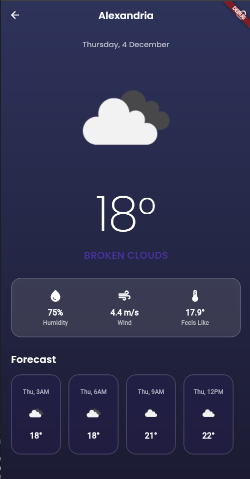
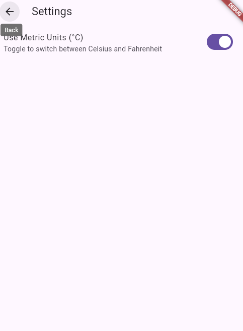

# 🌤️ Weather App

A beautiful and modern Flutter weather application with glassmorphism UI design, featuring real-time weather data, 5-day forecasts, and location-based search.

## 📱 Features

### Core Features
- **Real-time Weather Data**: Get current weather information for any city worldwide
- **5-Day Weather Forecast**: View detailed hourly/daily weather predictions
- **Country & City Selection**: Browse through 70+ countries and their major cities
- **Favorites System**: Save your favorite cities for quick access
- **Unit Conversion**: Toggle between Metric (°C) and Imperial (°F) temperature units
- **Persistent Storage**: All favorites and settings are saved locally

### UI/UX Features
- **Glassmorphism Design**: Modern glass-effect UI with blur and transparency
- **Dark Theme**: Eye-friendly dark color scheme with gradient backgrounds
- **Custom Typography**: Beautiful Google Fonts integration
- **Responsive Layout**: Works seamlessly on mobile, tablet, and web
- **Error Handling**: Graceful error messages and fallback mechanisms
- **Loading States**: Smooth loading indicators for better UX

## 🎨 Screenshots

### Weather Details Screen

### Select Country

### Select City

### Weather Details

### Favorites

### Settings


**Features shown:**
- Glassmorphism design with gradient background
- Large weather icon and temperature display
- City name and current date
- Weather description (Clear Sky)
- Detailed metrics in glass containers:
  - Humidity: 82%
  - Wind Speed: 2.6 m/s
  - Feels Like: 14.7°
- Horizontal scrollable forecast cards showing:
  - Hourly predictions (3AM, 6AM, 9AM, 12PM, 3PM)
  - Temperature and weather icons for each time slot
- Add to favorites button (heart icon)

### Key UI Elements
- **Dark Theme**: Beautiful gradient from deep blue to navy
- **Glassmorphism**: Frosted glass effect on all containers
- **Typography**: Clean Poppins font with proper hierarchy
- **Icons**: Weather-specific icons from OpenWeatherMap
- **Navigation**: Back button and favorites in app bar

## 🏗️ Project Structure

```
weather_app/
├── lib/
│   ├── main.dart                 # App entry point
│   ├── models/
│   │   └── weather_model.dart    # Weather & Forecast data models
│   ├── pages/
│   │   ├── home_page.dart        # Country/City selection screen
│   │   ├── details_page.dart     # Weather details & forecast
│   │   ├── favorites_page.dart   # Saved cities list
│   │   └── settings_page.dart    # App settings
│   ├── providers/
│   │   ├── weather_provider.dart # Weather state management
│   │   └── settings_provider.dart# Settings state management
│   ├── services/
│   │   ├── api_service.dart      # API calls (Weather, Countries, Cities)
│   │   └── storage_service.dart  # Local storage (SharedPreferences)
│   ├── theme/
│   │   └── app_theme.dart        # App theme & color definitions
│   ├── utils/
│   │   └── constants.dart        # API keys & constants
│   └── widgets/
│       └── glass_container.dart  # Reusable glassmorphism widget
├── pubspec.yaml                  # Dependencies
└── README.md                     # This file
```

## 🛠️ Technologies & Dependencies

### Core Dependencies
```yaml
dependencies:
  flutter:
    sdk: flutter
  
  # State Management
  provider: ^6.1.2
  
  # HTTP Requests
  http: ^1.2.2
  
  # Local Storage
  shared_preferences: ^2.3.4
  
  # Date Formatting
  intl: ^0.19.0
  
  # Custom Fonts
  google_fonts: ^6.3.2
```

### APIs Used
1. **OpenWeatherMap API**
   - Current Weather Data API
   - 5-Day/3-Hour Forecast API
   - Weather Icons

2. **REST Countries API**
   - Country list with fallback support

## 📦 Installation & Setup

### Prerequisites
- Flutter SDK (3.0.0 or higher)
- Dart SDK (3.0.0 or higher)
- Android Studio / VS Code
- Chrome (for web testing)

### Steps

1. **Clone the repository**
   ```bash
   git clone <repository-url>
   cd weather_app
   ```

2. **Install dependencies**
   ```bash
   flutter pub get
   ```

3. **Configure API Key**
   - Open `lib/utils/constants.dart`
   - The OpenWeatherMap API key is already configured:
     ```dart
     static const String apiKey = '0e971cf406a7eb20b92c5ec98b72d0e4';
     ```
   - (Optional) Replace with your own API key from [OpenWeatherMap](https://openweathermap.org/api)

4. **Run the app**
   ```bash
   # For Chrome (Web)
   flutter run -d chrome
   
   # For Android
   flutter run -d android
   
   # For Windows
   flutter run -d windows
   ```

5. **Build APK (Android)**
   ```bash
   flutter build apk --debug
   ```
   The APK will be located at: `build/app/outputs/flutter-apk/app-debug.apk`

## 🎯 Usage Guide

### 1. Search for Weather
1. Open the app
2. Select a **Country** from the dropdown (70+ countries available)
3. Select a **City** from the dropdown (major cities for each country)
4. Click **Search** button
5. View detailed weather information and forecast

### 2. Add to Favorites
1. After searching for a city, navigate to the details page
2. Click the **heart icon** in the top-right corner
3. The city will be saved to your favorites

### 3. View Favorites
1. Click the **heart icon** in the home page app bar
2. View all saved cities
3. Click on any city to view its weather
4. Swipe or click delete to remove from favorites

### 4. Change Temperature Units
1. Click the **settings icon** in the home page app bar
2. Toggle **"Use Metric Units"** switch
3. Temperature will change between °C and °F

## 🌐 API Reference

### OpenWeatherMap API

**Current Weather**
```
GET https://api.openweathermap.org/data/2.5/weather
Parameters:
  - q: City name
  - appid: API key
  - units: metric/imperial
```

**5-Day Forecast**
```
GET https://api.openweathermap.org/data/2.5/forecast
Parameters:
  - lat: Latitude
  - lon: Longitude
  - appid: API key
  - units: metric/imperial
```

### REST Countries API

**Get All Countries**
```
GET https://restcountries.com/v3.1/all
Returns: List of all countries with names
```

## 🎨 Design System

### Color Palette
- **Primary Background**: Linear Gradient (#1A1A2E → #16213E)
- **Accent Color**: #E94560 (Pink/Red)
- **Card Background**: Glassmorphism (12% white with blur)
- **Text Primary**: White (#FFFFFF)
- **Text Secondary**: White 70% opacity

### Typography
- **Font Family**: Poppins (Google Fonts)
- **Title Large**: 32px, Bold
- **Title Medium**: 24px, SemiBold
- **Body Medium**: 16px, Regular

### Glassmorphism Effect
- **Background**: 12% white opacity
- **Blur**: 10px sigma
- **Border**: 1.5px white 20% opacity
- **Shadow**: Black 10% opacity, 10px blur

## 🔧 Configuration

### Supported Countries & Cities

The app includes major cities for 30+ countries including:
- **Middle East**: Egypt, Saudi Arabia, UAE, Qatar, Kuwait, Bahrain, Oman, Lebanon, Jordan, Palestine, Syria, Iraq
- **Europe**: UK, France, Germany, Italy, Spain, Turkey, and more
- **Asia**: China, Japan, India, and more
- **Americas**: USA, Canada, Brazil, and more
- **Africa**: Morocco, Tunisia, Algeria, Libya, Sudan, and more

### Fallback Mechanism
If the REST Countries API fails, the app uses a built-in list of 70+ countries to ensure uninterrupted service.

## 🐛 Troubleshooting

### Common Issues

**1. API Key Error**
- Ensure the API key in `constants.dart` is valid
- Check your internet connection

**2. Build Errors**
- Run `flutter clean`
- Run `flutter pub get`
- Restart your IDE

**3. Countries Not Loading**
- The app will automatically use fallback country list
- Check internet connection for API access

**4. Images Not Loading**
- Weather icons are loaded from OpenWeatherMap CDN
- Error handling shows a cloud icon as fallback

## 📱 Platform Support

- ✅ **Android**: Fully supported
- ✅ **Web (Chrome)**: Fully supported
- ✅ **Windows**: Supported
- ⚠️ **iOS**: Not tested (should work with minor adjustments)

## 👨‍💻 Developer Information

**Development by Mohamed Osama**  
**ID**: 2305180

## 📄 License

This project is developed for educational purposes.

## 🙏 Acknowledgments

- **OpenWeatherMap** for weather data API
- **REST Countries** for country data API
- **Google Fonts** for Poppins font family
- **Flutter Team** for the amazing framework

---

**Last Updated**: December 2025  
**Version**: 1.0.0  
**Flutter Version**: 3.x
